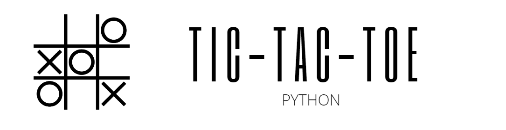

[Back to Home](https://teanlouise.github.io)

A simple tic-tac-toe game. This was completed as the milestone 1 project for Jose Portilla's "Zero-to-Hero Python" course. 

**Gameplay:**
1. Player One choose's a marker - X or O.
2. Randomly one of the players are chosen to go first.
3. Take turns placing a marker.
4. Continue until a player wins or the board is full and there is a tie.
5. Ask players if they want to play again.

